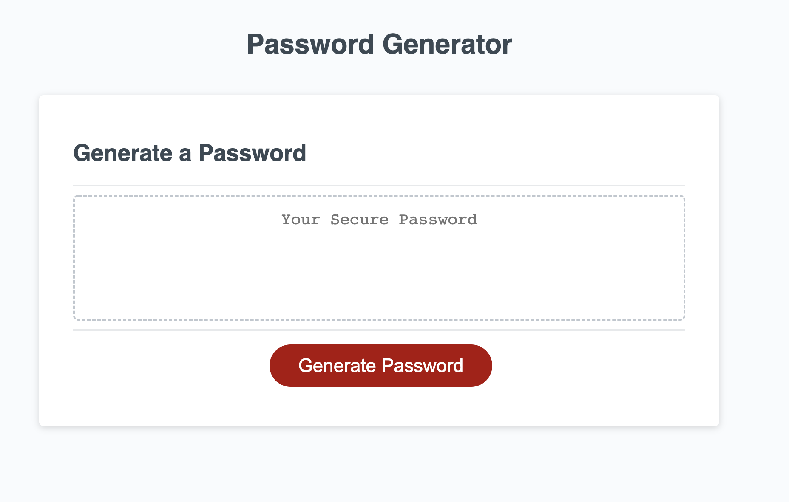
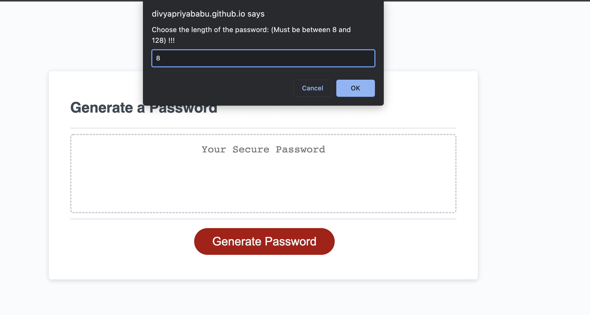
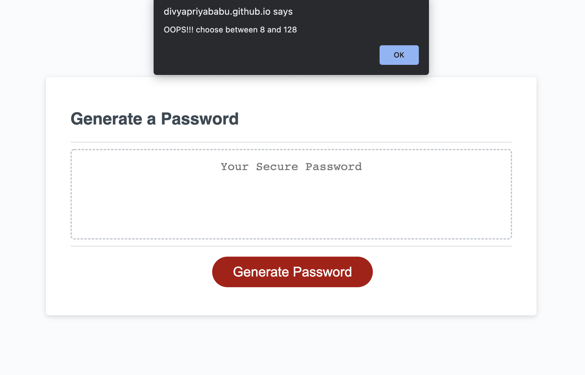
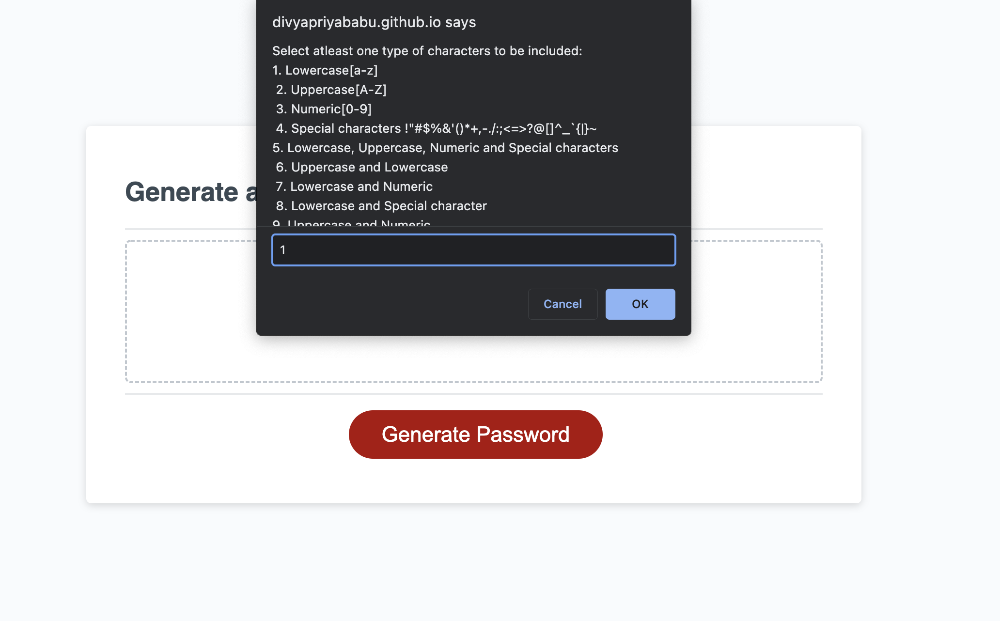
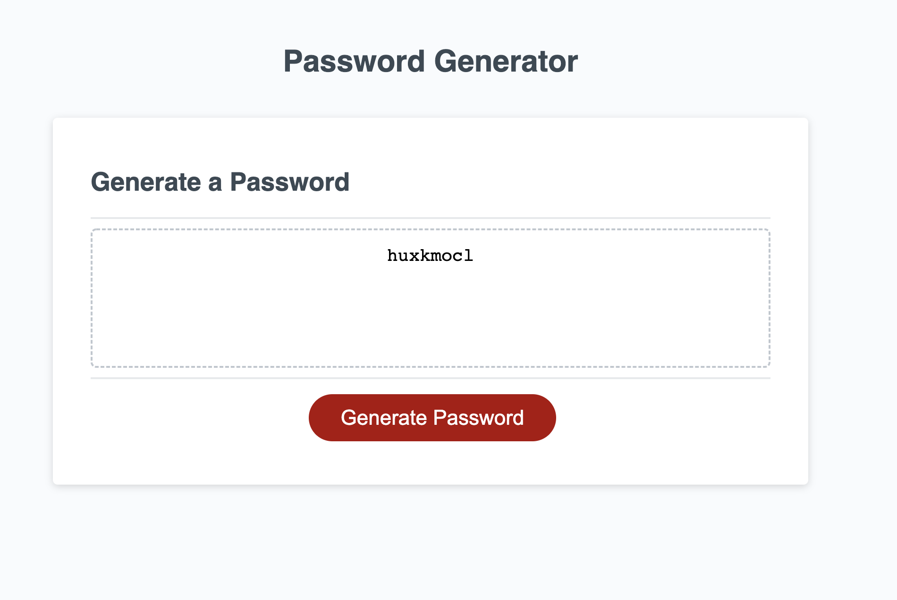

## About the repository

This repository contains changes to refactor code as part of University of Washington's Coding [bootcamp](https://bootcamp.uw.edu/coding/). There are two types of challenges in this course:

* On-the-job ticket or feature request challenges give a starter code in a folder called Develop, which we'll modify to complete the challenge.

* Job-seeking coding assessments or take-home assignments don't provide starter code. We'll build these from scratch.

## User story

```
AS AN employee with access to sensitive data
I WANT to randomly generate a password that meets certain criteria
SO THAT I can create a strong password that provides greater security
```

## Acceptance criteria

```
GIVEN I need a new, secure password
WHEN I click the button to generate a password
THEN I am presented with a series of prompts for password criteria
WHEN prompted for password criteria
THEN I select which criteria to include in the password
WHEN prompted for the length of the password
THEN I choose a length of at least 8 characters and no more than 128 characters
WHEN asked for character types to include in the password
THEN I confirm whether or not to include lowercase, uppercase, numeric, and/or special characters
WHEN I answer each prompt
THEN my input should be validated and at least one character type should be selected
WHEN all prompts are answered
THEN a password is generated that matches the selected criteria
WHEN the password is generated
THEN the password is either displayed in an alert or written to the page
```

## Changes added

* Add function to get input from user - Length of password and Character combination required

* Add function to generate random password based on the input

* Use window.alert to alert the errors in input

## Result

Deployed URL: https://divyapriyababu.github.io/Password_Generator/









